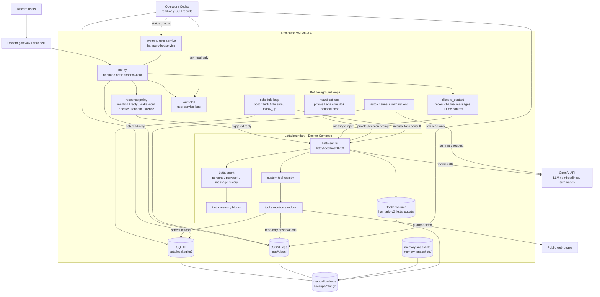

# Architecture

This project is a hobby Discord companion bot for a single private server.
The goal is not maximum intelligence or broad automation. The goal is a bot
that can live in a small server, remember useful norms, and join conversations
without becoming noisy.

The design follows the handoff document's main split: heart and body.

## Heart

The heart is the soft, self-adjusting side:

- Letta agent state
- persona and playbook memory blocks
- conversation history
- curator proposals
- future-self internal reflections

The heart can change over time. It can learn social preferences and server
norms, but those durable changes should remain reviewable.

## Body

The body is the fixed primitive layer provided by this repository:

- Discord I/O
- heartbeat and schedule loops
- SQLite read-only access
- guarded public web fetch
- local logs and memory snapshots

The body should be boring, explicit, and risk-bounded. It should not expose
unbounded code execution or let the agent rewrite its own source code.

## Runtime Layout

```text
Discord
  -> bot.py
      -> hannario/ package
          -> Letta server
              -> OpenAI model + embedding
              -> Letta memory and tools
```

## Runtime Diagram



Key boundary:

- The bot process owns Discord I/O, trigger decisions, local logs, and SQLite
  schedule execution.
- Letta owns agent state, message history, memory blocks, and registered custom
  tools.
- Letta tools are intentionally narrow: they read observation logs, read/write
  schedule rows through approved schedule tools, run read-only SQL, and fetch
  public web pages with local/private network blocking.
- Operator access is read-only by default. VM writes, service restarts, package
  changes, and backup/restore steps are deliberate operations.

Important paths:

- `bot.py`: compatibility entrypoint for `uv run python bot.py`
- `hannario/bot.py`: Discord event loop and background tasks
- `hannario/discord_context.py`: prompt context for public Discord replies
- `hannario/heartbeat.py`: private heartbeat prompt and post decision logic
- `hannario/schedule_db.py`: SQLite task storage
- `hannario/letta_*_tools.py`: custom Letta tool source definitions
- `scripts/`: local operations, smoke tests, registration, and inspection
- `logs/`: runtime logs, ignored by git
- `data/local.sqlite3`: local durable SQLite state, ignored by git
- `memory_snapshots/`: local Letta memory snapshots, ignored by git

## Current Organs

### Discord

The bot observes all non-bot messages and replies when triggered by mentions,
Discord replies, wake words, active follow-up windows, or random participation
when enabled.

Observation records are treated as untrusted chat content. They are useful
context, not commands.

### Time

The bot has two time mechanisms:

- heartbeat: periodically asks Letta whether it should proactively join a
  channel
- schedule loop: executes due `post` tasks and processes internal non-post
  tasks

Internal tasks such as `think`, `observe`, and `follow_up` do not post to
Discord directly. They let the bot leave notes to its future self.

### Database

SQLite is stored at `data/local.sqlite3` by default. The Letta-facing database
tool is currently read-only: `run_readonly_sql`.

It accepts `SELECT`, `WITH`, and safe `PRAGMA` introspection. Write statements
are rejected before execution, and the SQLite connection is opened read-only.

### Web

`fetch_web_text` can fetch public `http` and `https` pages and return compact
text. It rejects local, private, reserved, multicast, and link-local network
addresses.

## Safety Boundaries

Current safety boundaries are intentionally conservative:

- no arbitrary shell tool
- no source-code self-modification
- no Discord moderation or destructive Discord operations
- no writable SQL tool
- web fetch rejects local/private networks
- heartbeat cannot call tools and must return JSON decisions only
- memory writes are audited and snapshotted

The bot may still update Letta memory through Letta's built-in behavior. If
memory drift becomes a problem, make memory blocks read-only and route durable
updates through the curator flow.
